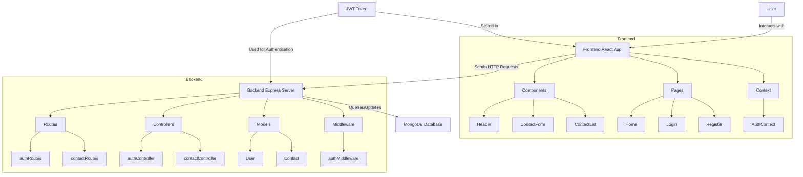

# phone-book-app
# Phone Book Application

This is a full-stack phone book application built with React, Express, MongoDB, and Node.js. It allows users to manage their contacts securely with authentication.

## Table of Contents

- [Features](#features)
- [Application Structure](#application-structure)
- [Setup and Installation](#setup-and-installation)
- [Usage](#usage)
- [API Endpoints](#api-endpoints)
- [Technologies Used](#technologies-used)
- [Contributing](#contributing)
- [License](#license)

## Features

- User registration and login with JWT authentication
- Create, read, update, and delete contacts
- Responsive design with Tailwind CSS
- Toast notifications for user feedback

## Application Structure

The application is divided into two main parts: the frontend (client-side) and the backend (server-side). Here's a diagram illustrating the structure and flow of the application:

### Explanation of the Diagram

1. **User Interaction**: The user interacts with the Frontend React App through the browser.

2. **Frontend React App**: This is the client-side of the application, built with React. It consists of:
   - Components: Reusable UI elements (Header, ContactForm, ContactList)
   - Pages: Main views of the application (Home, Login, Register)
   - Context: Manages global state, specifically authentication state (AuthContext)

3. **Backend Express Server**: This is the server-side of the application, built with Express.js. It handles:
   - Routes: Define API endpoints (authRoutes, contactRoutes)
   - Controllers: Contain the logic for handling requests (authController, contactController)
   - Models: Define the structure of the data (User, Contact)
   - Middleware: Functions that process requests before they reach the route handlers (authMiddleware)

4. **MongoDB Database**: Stores all the application data (users and contacts).

5. **JWT Token**: Used for authenticating users. It's generated by the backend, stored in the frontend, and sent with requests to authenticate API calls.

6. **Data Flow**: 
   - The Frontend sends HTTP requests to the Backend.
   - The Backend processes these requests, interacts with the Database as needed, and sends responses back to the Frontend.
   - The Frontend updates its state and UI based on these responses.

This structure allows for a clear separation of concerns, with the frontend handling user interactions and display, and the backend managing data persistence and business logic.

## Setup and Installation

1. Clone the repository
2. Install dependencies for both frontend and backend
3. Set up MongoDB Atlas database
4. Configure environment variables
5. Run the backend server
6. Run the frontend development server

(Detailed steps would be provided here)

## Usage

After setting up the application:

1. Register a new account or log in with existing credentials
2. View your contacts on the home page
3. Add new contacts using the form
4. Edit or delete existing contacts using the buttons provided
5. Log out when finished

## API Endpoints

- POST /api/auth/register - Register a new user
- POST /api/auth/login - Log in a user
- GET /api/contacts - Get all contacts for the authenticated user
- POST /api/contacts - Create a new contact
- PUT /api/contacts/:id - Update an existing contact
- DELETE /api/contacts/:id - Delete a contact

## Technologies Used

- Frontend: React, Tailwind CSS, Axios
- Backend: Node.js, Express.js
- Database: MongoDB
- Authentication: JSON Web Tokens (JWT)
- Additional: react-toastify for notifications

## Contributing

Contributions are welcome! Please feel free to submit a Pull Request.

## License

This project is licensed under the MIT License.